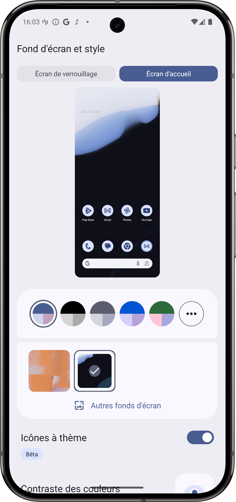
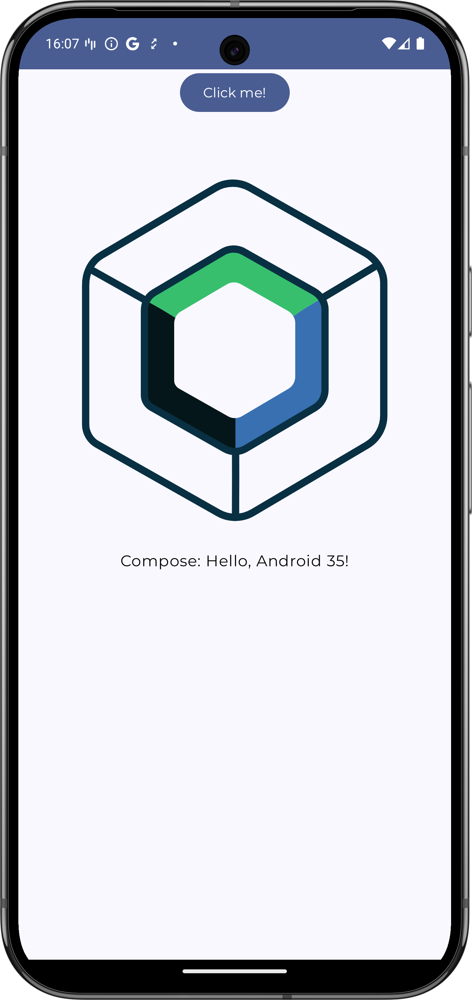
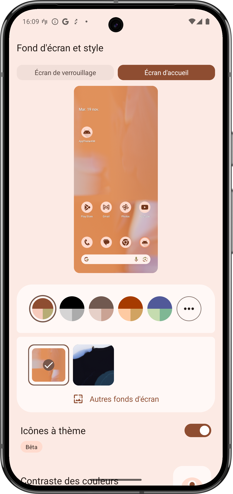
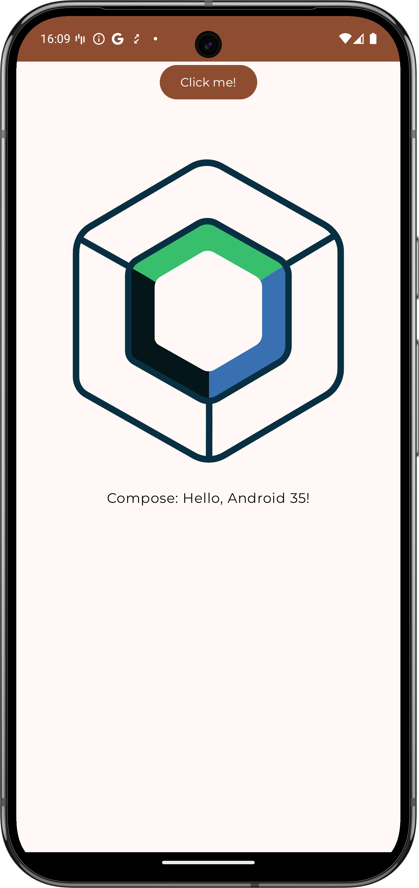
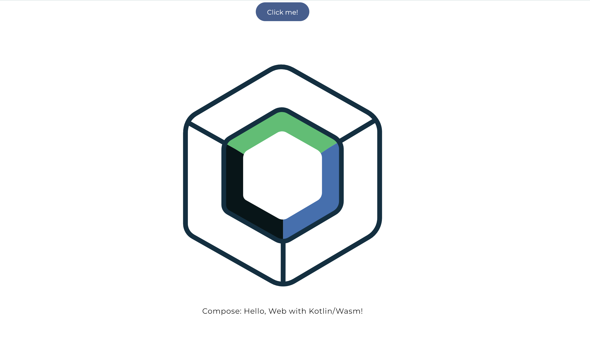
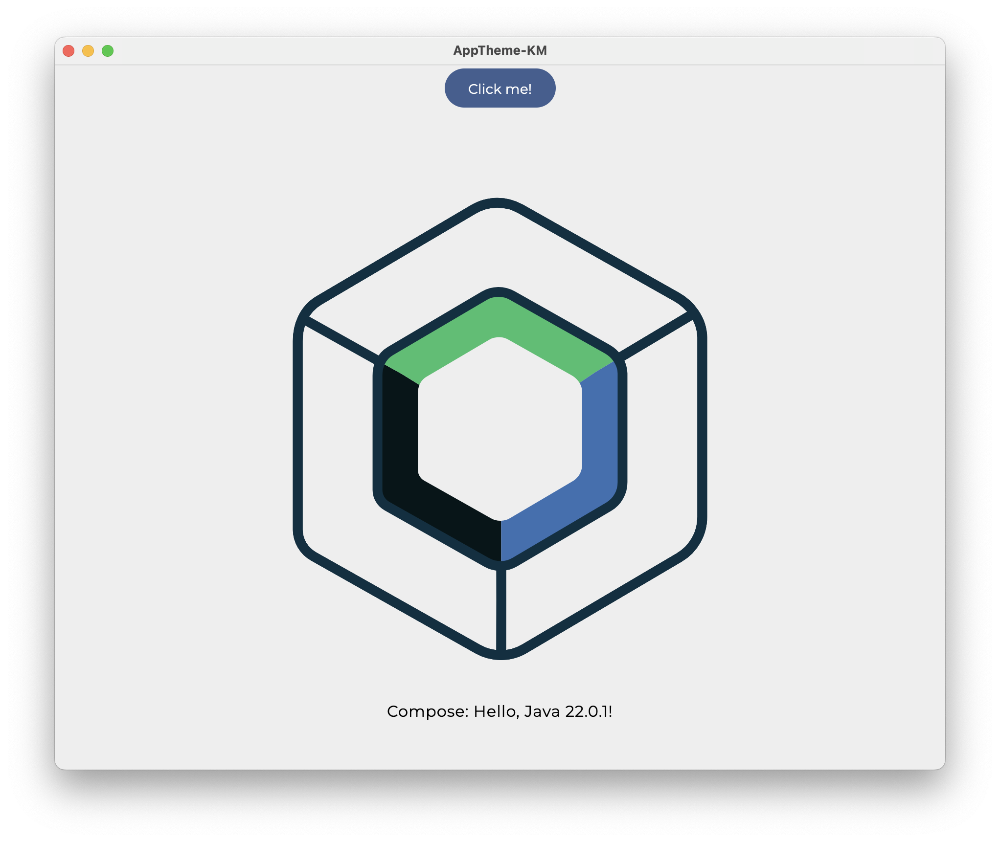
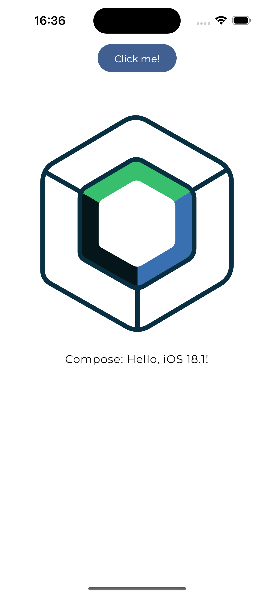

# Handling Android Dynamic Colors in a Kotlin Multiplatform Compose App

This repository provides a working example of how to implement Android's dynamic colors in a Kotlin Multiplatform Compose application. This allows your app to adapt its color scheme to the user's wallpaper on Android, while maintaining a default theme for other platforms like iOS, desktop, and web.

**Key Features:**

* **Dynamic Colors on Android:** Utilizes Android 12+'s dynamic color capability to extract colors from the user's wallpaper and apply them to the app's theme.
* **Cross-Platform Compatibility:**  Maintains a consistent theme across Android, iOS, desktop, and web using Kotlin's `expect` and `actual` functions for platform-specific implementations.
* **Custom Theming:**  Demonstrates how to create and apply custom themes using Material Theme Builder and integrate them into your KMP project.
* **Font Handling:** Shows how to manage fonts in a KMP project, addressing the limitations of using Google Fonts.
* **Monochromatic App Icon:**  Implements a monochromatic app icon for Android that dynamically adapts to the user's wallpaper.


**Implementation Details:**

1. **Dependencies:** Adds the necessary Material Design dependency for Android.
2. **Theme Creation:** Guides you through creating a custom theme using Material Theme Builder and importing it into your project.
3. **Platform-Specific Color Schemes:** Uses `expect` and `actual` functions to define platform-specific implementations for providing color schemes.
4. **Font Management:**  Provides a workaround for using custom fonts in a KMP project.
5. **App Icon Adaptation:**  Demonstrates how to create an adaptive app icon for Android.
6. **Theme Application:**  Applies the theme to your Compose application.


**This example project demonstrates how to:**

* Effectively handle platform-specific features like dynamic colors in a KMP project.
* Maintain a consistent look and feel across different platforms.
* Overcome challenges related to font management in KMP development.

This README provides a concise summary of the Medium article and the accompanying code in this repository. For a more detailed explanation and step-by-step guide, please refer to the original article on Medium (link provided in the repository).

This is a Kotlin Multiplatform project targeting Android, iOS, Web, Desktop.

* `/composeApp` is for code that will be shared across your Compose Multiplatform applications.
  It contains several subfolders:
  - `commonMain` is for code that’s common for all targets.
  - Other folders are for Kotlin code that will be compiled for only the platform indicated in the folder name.
    For example, if you want to use Apple’s CoreCrypto for the iOS part of your Kotlin app,
    `iosMain` would be the right folder for such calls.

* `/iosApp` contains iOS applications. Even if you’re sharing your UI with Compose Multiplatform, 
  you need this entry point for your iOS app. This is also where you should add SwiftUI code for your project.


Learn more about [Kotlin Multiplatform](https://www.jetbrains.com/help/kotlin-multiplatform-dev/get-started.html),
[Compose Multiplatform](https://github.com/JetBrains/compose-multiplatform/#compose-multiplatform),
[Kotlin/Wasm](https://kotl.in/wasm/)…

We would appreciate your feedback on Compose/Web and Kotlin/Wasm in the public Slack channel [#compose-web](https://slack-chats.kotlinlang.org/c/compose-web).
If you face any issues, please report them on [GitHub](https://github.com/JetBrains/compose-multiplatform/issues).


You can open the web application by running the Gradle task
```
./gradlew :composeApp:wasmJsBrowserDevelopmentRun
```






On other platforms



